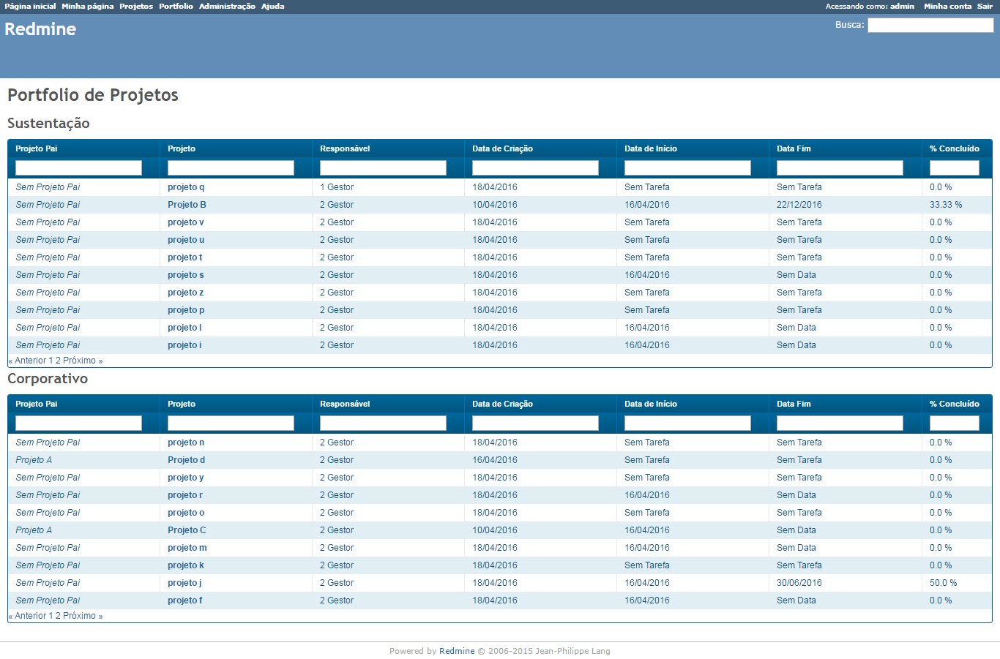
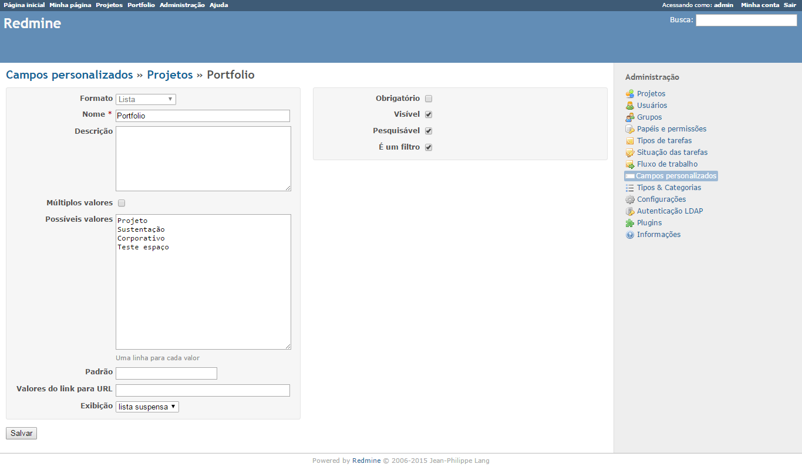
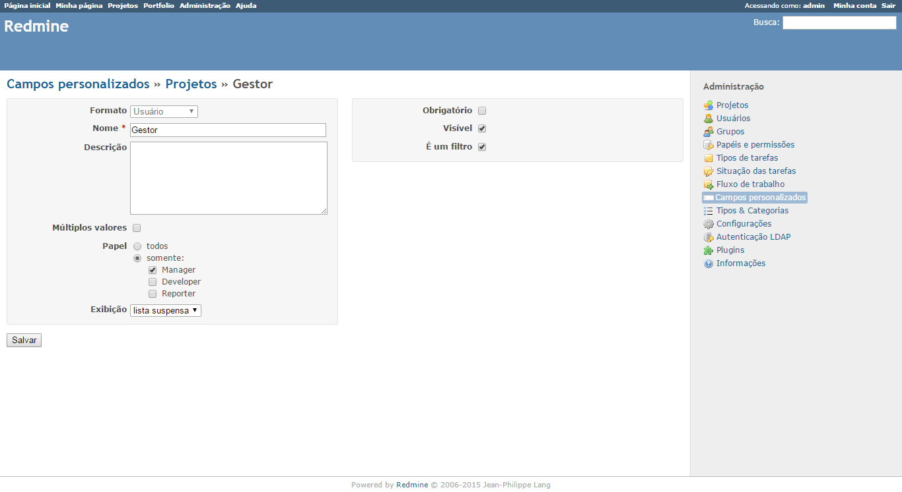
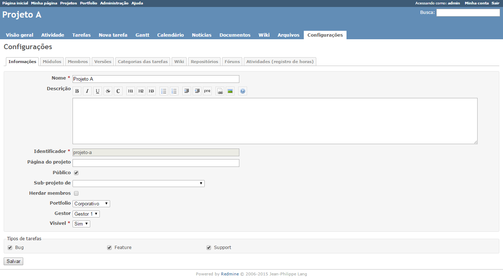

# Redmine Portfolio Management plugin 
[](https://github.com/marcus-sacramento-redmine/redmine_portfolio_management/tags) [](https://github.com/marcus-sacramento-redmine/redmine_portfolio_management/releases) [](https://github.com/marcus-sacramento-redmine/redmine_portfolio_management/releases)

GitHub tag GitHub Releases (by Release) GitHub All Releases
>Você pode testá-lo gratuitamente em nosso [Redmine para demonstração](http://redmine-marcusacramento.rhcloud.com/) com usuário e senha: visitante


>>[](https://travis-ci.org/marcus-sacramento-redmine/redmine_portfolio_management)

>>[](https://www.codacy.com/app/marcus-vinicius-cardozo/redmine_portfolio_management) [](https://codeclimate.com/github/marcus-sacramento-redmine/redmine_portfolio_management) [](https://github.com/marcus-sacramento-redmine/redmine_portfolio_management/issues) [](http://waffle.io/marcus-sacramento-redmine/redmine_portfolio_management) [](http://waffle.io/marcus-sacramento-redmine/redmine_portfolio_management)

>>[](https://github.com/marcus-sacramento-redmine/redmine_portfolio_management/commits/master) 

>>[](LICENSE) 

### Features  ([Changelog do Projeto](CHANGELOG.md)):
* Grouping of Projects in a simplified Portfolio view
* Simple filtering and sorting
* Pagination for better project visibility
* Definition of Project Start and End Dates based on task dates:

    * Start Date: Earliest date in the 'Start' field of tasks directly associated with the project
    * End Date: Latest date in the 'Due Date' field of tasks directly associated with the project

* Calculation of Project Completion Percentage:

    * Calculated based on the total number of completed tasks over the total tasks in the project

>> 

***
### Attention

* Read the installation instructions carefully;
* This is an OpenSource project under license;
* This project was developed as an experience in Ruby, so fixes and/or suggestions may take some time depending on the developer’s availability;
* To learn how to contribute to the project, please read the Contributing Guide and Project Wiki

***

### Informações sobre o ambiente utilizado no desenvolvimento:
```
Environment:
  Redmine version                3.2.0.stable.14972
  Ruby version                   2.2.3-p173 (2015-08-18) [x86_64-linux]
  Rails version                  4.2.5
  Environment                    production
  Database adapter               PostgreSQL
SCM:
  Subversion                     1.7.14
  Git                            1.8.3.1
  Filesystem  
```

***

### Plugin Installation

1.    Clone the project using git: https://github.com/marcus-sacramento-redmine/redmine_portfolio_management.git into the redmine/plugins directory of your Redmine installation.
2.    Run the command bundle install to download the project dependencies.
3.    Run the command rake redmine:plugins:migrate RAILS_ENV=production to apply the plugin migration.
4.   Restart the Apache service: service httpd restart

***

### Configuração do Plugin

>> O Plugin exige que sejam configurados alguns campos customizados para os Projetos no Redmine. Os valores nestes Campos Customizados serão exibidos na página principal do plugin

* Configure o Campo Customizado para o Portfolio do Projeto. Esse campo deverá ser do formato Lista e **não** aceitar múltiplos valores. Nos possíveis valores se encontrarão os nomes a serem dados aos Portfolios de Projeto:

>> 

* Configure o Campo Customizado para o Responsável pelo Projeto. Esse campo deverá ser do formato Usuário e **não** aceitar múltiplos valores. Defina os papéis que poderão ser responsáveis pelo projeto:

>> 

* Nas Configurações do Projeto deve-se sempre haver membros associados ao perfil indicado no campo customizado 'Responsável pelo Projeto' antes da configuração dos valores associados ao plugin. Deve-se atualizar a página do Redmine para que as configurações sejam carregadas.

* Após adicionar os membros basta definir o Portfolio e o membro que será o responsável pelo projeto. Caso fique em branco o campo de Portfolio, o projeto não será exibido no plugin:

>> 

### Remoção do Plugin

Para remover o plugin basta remover o diretório do plugin no diretório ```redmine/plugins``` da instalação do Redmine, e reiniciar o  serviço do Apache:```service httpd restart```

